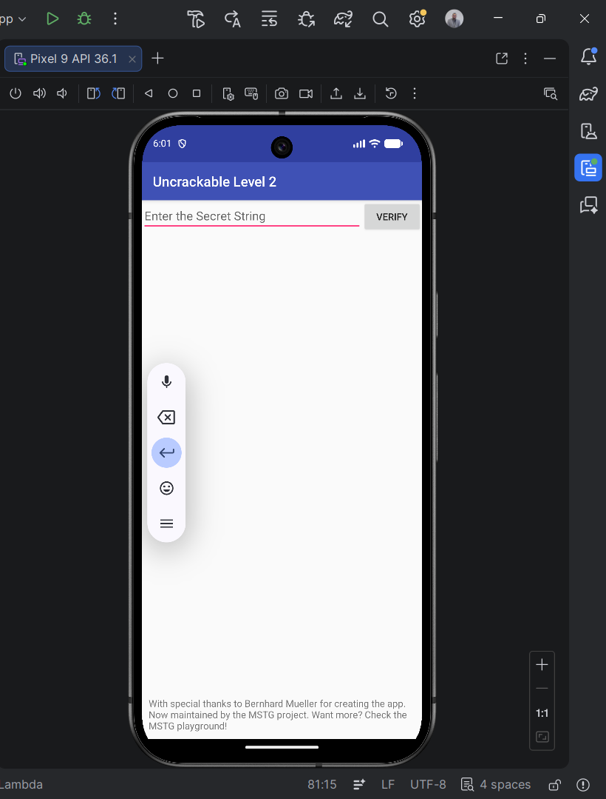
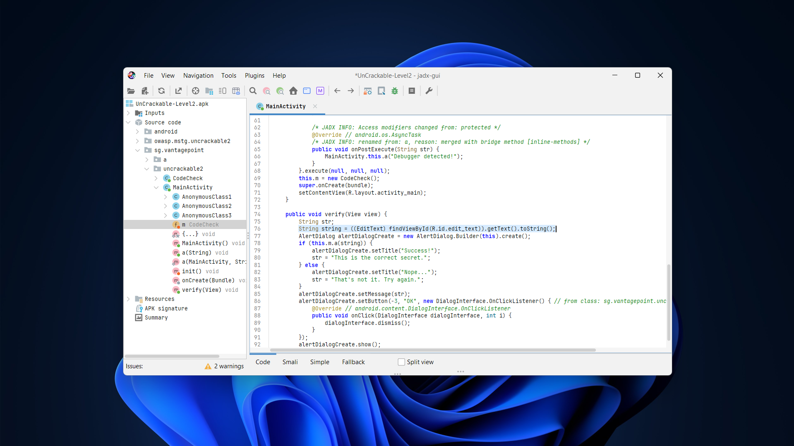
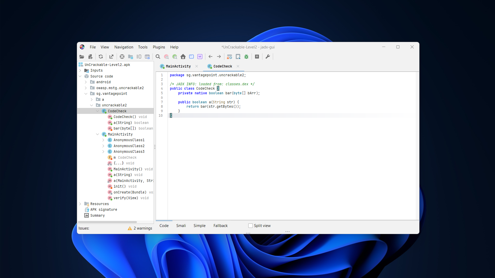
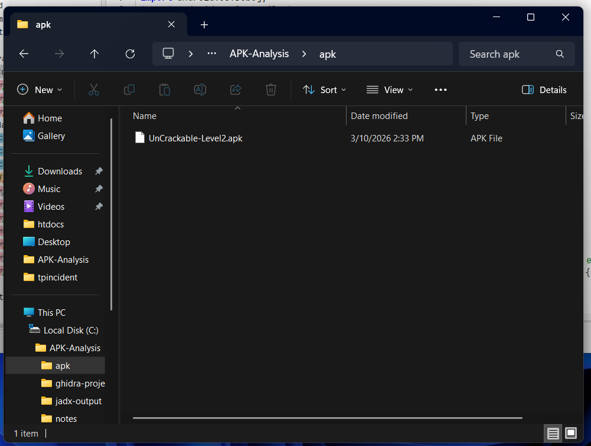
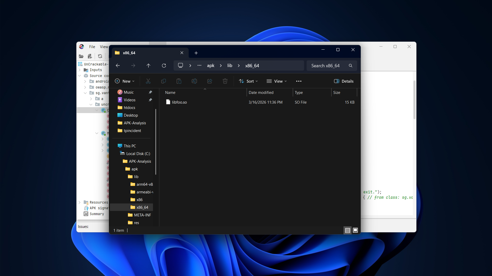
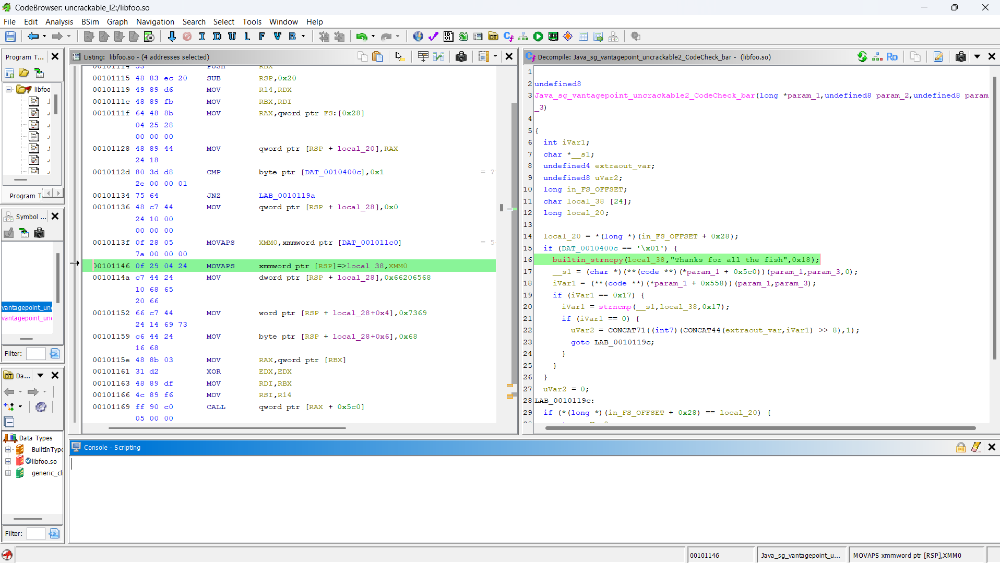
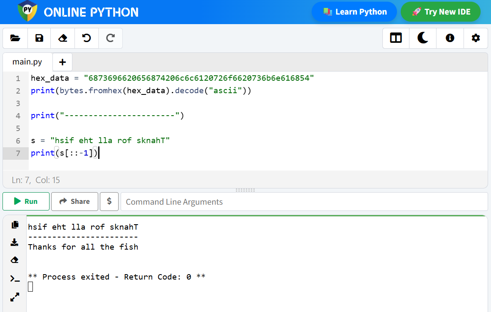
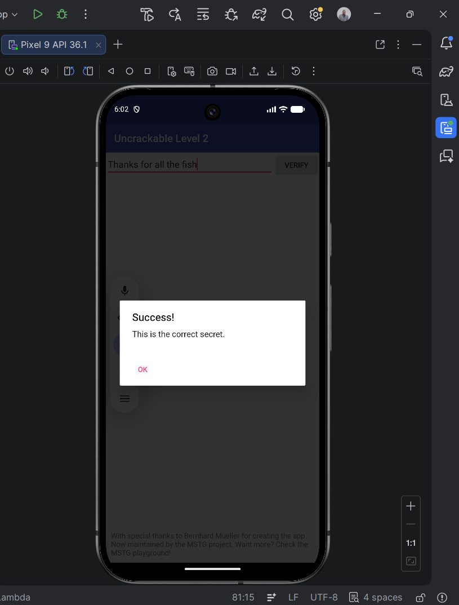

# Lab_5_MobileSecurity
### Analyse de l’application Android UnCrackable Level 2

## Présentation

Ce travail a pour objet d’examiner le mécanisme de vérification intégré dans l’application **UnCrackable Level 2** afin d’identifier la valeur attendue par le programme.  
La démarche adoptée repose sur une lecture progressive du code Java, puis sur l’examen de la bibliothèque native chargée par l’application.

---

## Mise en situation

Au lancement, l’application présente une interface sobre composée d’un champ de saisie et d’un bouton de validation.  
L’utilisateur est invité à entrer une chaîne de caractères qui sera ensuite soumise à un contrôle interne.

---

## Repérage du point d’entrée

L’ouverture de l’APK dans **JADX** permet d’identifier la classe `MainActivity` comme point de départ du traitement côté interface.  
On y constate que la chaîne saisie est récupérée depuis le champ de texte, puis transmise à une autre partie du programme chargée d’effectuer la vérification.

La donnée utile suit donc ce chemin :
- récupération de la chaîne dans `MainActivity`
- transmission à une classe dédiée au contrôle

---

## Mise en évidence de la logique de contrôle

L’examen de la classe `CodeCheck` montre que la vérification ne repose pas uniquement sur du code Java.  
On y repère une méthode `native`, ce qui signifie que son implémentation réelle se trouve dans une bibliothèque compilée.

La présence de l’instruction `System.loadLibrary("foo")` confirme le chargement d’un composant natif.  
La partie décisive du mécanisme est donc déplacée vers un fichier `.so`.

---

## Localisation de la bibliothèque native

Après extraction du contenu de l’APK, on retrouve un dossier `lib` contenant plusieurs sous-répertoires liés aux différentes architectures matérielles.  
L’un de ces répertoires contient le fichier **libfoo.so**, qui correspond à la bibliothèque mentionnée dans le code Java.

Cette étape permet d’isoler le binaire natif à examiner plus en détail.

---

## Examen du code natif avec Ghidra

Le fichier `libfoo.so` est ensuite importé dans **Ghidra** afin d’obtenir une vue désassemblée et une version décompilée plus lisible du programme.  
La recherche des symboles exportés mène à la fonction JNI liée à `CodeCheck.bar(...)`.

L’étude de cette fonction met en évidence l’emploi de `strncmp`, utilisée pour confronter l’entrée utilisateur à une valeur de référence stockée dans la bibliothèque.

---

## Retrouver la valeur attendue

Dans le pseudo-code produit par Ghidra, la chaîne de référence apparaît explicitement.  
La valeur utilisée lors de la comparaison est :

`Thanks for all the fish`

Une vérification complémentaire a également été réalisée à l’aide d’un court test Python afin de confirmer la lecture finale de la chaîne observée.

---

## Validation finale

Une fois la chaîne retrouvée, elle est saisie dans l’application.  
Le programme renvoie alors un message de succès, ce qui confirme que la valeur découverte correspond bien au secret attendu par le mécanisme de vérification.

---

## Résultat obtenu

La chaîne correcte est :

`Thanks for all the fish`

---

## Schéma logique du fonctionnement

Le déroulement global peut être résumé de la manière suivante :

`Entrée utilisateur → MainActivity → CodeCheck → bibliothèque native libfoo.so → comparaison avec strncmp → succès ou échec`

---

## Bilan

Cette étude met en évidence un cas classique où la logique sensible n’est pas laissée dans les classes Java visibles au premier regard, mais déplacée vers une bibliothèque native.  
L’approche retenue a consisté à suivre le trajet de la donnée saisie, à repérer le basculement vers le code natif, puis à relire la fonction de comparaison jusqu’à retrouver la chaîne attendue.

Ce travail a permis de :
- repérer le point d’entrée côté interface
- suivre la circulation de la chaîne saisie
- identifier l’usage d’une bibliothèque native
- lire une fonction JNI dans Ghidra
- retrouver la valeur correcte validant le challenge
